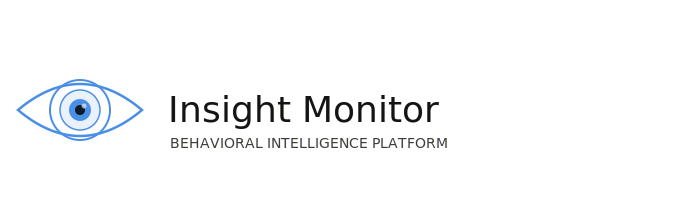

<!-- ===================================================== -->

<!-- LOGO PLACEHOLDER -->

<!-- Replace with actual logo/banner later -->

<!-- ===================================================== -->

  

<h1 align="center">Insight Monitor</h1>

  <strong>Understanding work through context, not guesswork.</strong>

  Behavioral intelligence for modern digital work.

---

## 🚀 Our Mission

Most productivity tools measure **activity**.

We focus on **intent**.

Insight Monitor is a behavioral intelligence platform that transforms computer activity into structured insight about what people are trying to accomplish, how work flows across tasks, and where attention is spent.

By combining system telemetry, content understanding, interaction patterns, and temporal context, we generate evidence-based models of work behavior.

---

## ✨ Why Insight Monitor?

Traditional monitoring systems answer:

> "What application was open?"

Insight Monitor attempts to answer:

> "What was the user trying to accomplish?"

Context changes everything.

The same website, document, or application can represent research, focused work, collaboration, learning, planning, or distraction depending on the surrounding evidence.

---

## 🧠 What We Build

### 🔍 Context-Aware Activity Understanding

Move beyond simplistic productive/unproductive classifications.

### 🧩 Task Reconstruction

Identify workflows, task chains, and context switches.

### 📊 Behavioral Intelligence

Generate structured data that powers analytics, automation, and decision-making.

### 🤖 Multimodal AI Inference

Combine multiple signal types to estimate intent and work context.

### 🔒 Privacy-Conscious Design

Purpose-driven collection, explainable inference, and configurable transparency.

---

## ⚙️ Signals We Analyze

| Signal Type            | Examples                                                |
| ---------------------- | ------------------------------------------------------- |
| 🖥️ System Signals     | Active windows, application metadata, focus transitions |
| 📄 Content Signals     | OCR text, accessibility APIs, URLs, document context    |
| ⌨️ Interaction Signals | Navigation patterns, user actions, input activity       |
| ⏱️ Temporal Signals    | Session duration, interruptions, continuity patterns    |

---

## 📈 Intelligence Outputs

* 🎯 Intent hypotheses
* 🔗 Task-chain reconstruction
* 🔄 Context-switch detection
* 📉 Distraction analysis
* 📈 Focus analysis
* ⚡ Efficiency estimation
* 🤔 Uncertainty-aware low-interaction classification

Every inference includes supporting evidence and confidence information.

---

## 🏗️ Core Products

### Inference Platform

The core Insight Monitor engine.

Collects signals, performs analysis, and produces structured behavioral intelligence.

### Applications & Integrations

Built on top of the inference platform:

* Team dashboards
* Productivity analytics
* Workflow insights
* Reporting systems
* Third-party integrations

---

## 📦 Projects

### 📚 Documentation

The central knowledge base, architecture documentation, and project vision.

➡️ https://github.com/insight-monitor/insight-monitor-docs

### ⚙️ Core Platform

The primary implementation of the Insight Monitor platform.

➡️ https://github.com/insight-monitor/insight-monitor-code

---

## 🌱 Ecosystem Vision

Insight Monitor is designed as a platform, not a single application.

Over time, additional repositories will provide:

* Desktop clients
* Web dashboards
* API SDKs
* Integrations
* Analytics tooling
* Research projects
* Community extensions

All built on top of the same behavioral intelligence foundation.

---

## 🗺️ Roadmap

### Phase 1 — Foundation

* [x] Define behavioral intelligence model
* [x] Establish inference architecture
* [x] Create documentation and platform vision
* [ ] Core signal collection pipeline
* [ ] Initial inference engine

### Phase 2 — Platform

* [ ] Behavioral intelligence API
* [ ] Event processing infrastructure
* [ ] Confidence scoring framework
* [ ] Explainability system

### Phase 3 — Applications

* [ ] Productivity dashboard
* [ ] Team analytics
* [ ] Workflow reporting
* [ ] Alerting and automation

### Phase 4 — Ecosystem

* [ ] Public SDKs
* [ ] External integrations
* [ ] Community tooling
* [ ] Research collaborations

---

## 🔒 Privacy & Transparency

Insight Monitor is built around explicit collection boundaries and explainable inference.

* Purpose-driven collection
* Configurable visibility
* Local processing where possible
* Confidence-based outputs
* Evidence-backed conclusions

We estimate probable intent.

We do **not** claim certainty, mind-reading, or absolute productivity measurement.

---

## 🤝 Contributing

We're building the future of behavioral intelligence and contextual productivity analytics.

As the ecosystem grows, contributions, feedback, research discussions, and integrations will be welcomed.

---

## 📖 Learn More

Documentation:

https://github.com/insight-monitor/insight-monitor-docs

---

  <em>Making digital work understandable—not merely observable.</em>

